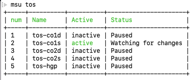
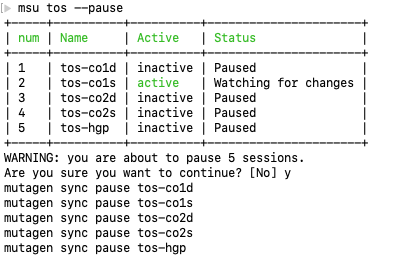

# Mutagen Sync sessions cli utility

This php utility helps to manage Mutagen Sync sessions and allows to run some commands on multiple sessions.

## Install phar command

Download bin/msu.pahr and save into ~/bin/msu or a directory in your execution path.

## Usage examples

List all sessions:

```shell
msu  
```

List all sessions containing "tos":

```shell
msu tos
```



```shell
msu tos --pause
```



```shell
msu tos-co1d --resume
```

Show help:

```shell
msu help
```

